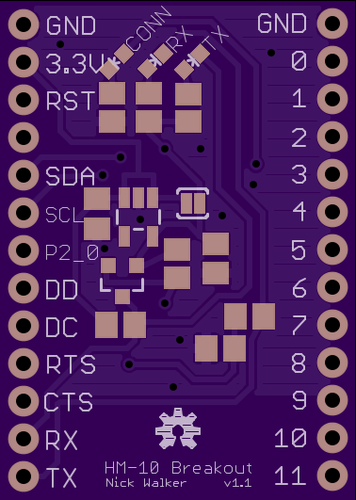
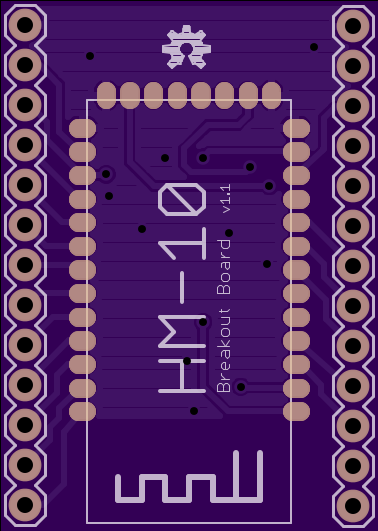

HM-10 Breakout Board
====================

This is a slight modification of [Ladvien's board](https://github.com/Ladvien/HM-10). This version has more accurate pin notations and removes routes to unused pins on the HM-10, thereby shrinking the overall footprint of the board. 
The HM-10's on board TI CC2541 is fully programmable with CC-Debugger or SmartRF04EB. See this repo's [wiki](https://github.com/nickswalker/HM-10-breakout-board/wiki) for more resources.

### Who is This Board For?

Two groups of people: Those wanting to make the HM-10 breadboard-friendly and those wanting a cheaper, more flexible alternative to TI's CC2541 dev kits.

## Bill of Materials

If you are planning on ordering the PCB through OSHPark, keep in mind that you will receive three copies. You may want to go ahead and order three times as many components. Digi-Key numbers are provided as a courtesy; check eBay or any other preferred supplier for better pricing. As long as the component matches the packaging a specifications, it should be fine.

At a bare minimum, the PCB and the HM-10 module are required. You'll probably want to use the UART connection in your project, so you'll want to populate those components too.

Part (Digi-Key #) | Quantity | Optional (Required For)
:---------------- | :-------:| :----------------------
[Breakout PCB](https://oshpark.com/shared_projects/A6hoH6Fi)  | 1 | No
[HM-10 Module](http://www.fasttech.com/products/0/10004051/1292002-ti-cc2540-bluetooth-40-ble-2540-transparent-serial) | 1 | No
[0805 20kΩ Resistor](http://www.digikey.com/product-detail/en/RMCF0805JT20K0/RMCF0805JT20K0CT-ND/1942580) (RMCF0805JT20K0CT-ND) | 1 | Yes (UART level conversion)
[0805 10kΩ Resistor](http://www.digikey.com/product-detail/en/RMCF0805FT10K0/RMCF0805FT10K0DKR-ND/1943341) (RMCF0805FT10K0CT-ND) | 3 | Yes (UART level conversion)
[0603 LED](http://www.digikey.com/product-detail/en/LTST-C191KRKT/160-1447-1-ND/386836) (160-1447-1-ND) | 1 | Yes (LEDs)
[0603 LED (>3v drop)](http://www.digikey.com/product-detail/en/APT1608QBC%2FD/754-1434-1-ND/2163792) (754-1434-1-ND) | 2 | Yes (LEDs)
[0805 470Ω Resistor](http://www.digikey.com/product-detail/en/RMCF0805JG470R/RMCF0805JG470RCT-ND/4425246) (RMCF0805JG470RCT-ND) | 3 | Yes (LEDs)
[SOT-23 MCP1700 Voltage Regulator](http://www.digikey.com/product-detail/en/MCP1700T-3302E%2FTT/MCP1700T3302ETTCT-ND/652677) (MCP1700T3302ETTCT-ND) | 1 | Yes (voltage regulator)
[0805 1uF Capacitor](http://www.digikey.com/product-detail/en/JMK105BJ105KV-F/587-1231-1-ND/931008) (587-1231-1-ND) | 1 | Yes (Voltage regulator)

The silkscreen doesn't include values, so be sure to have it open in front of you while you assemble.

## Links

[This repo's wiki](https://github.com/nickswalker/HM-10-breakout-board/wiki) is a good resource for information on using the HM-10 as a BLE development platform.

Assembly: http://www.instructables.com/id/How-to-Create-an-Arduino-Compatible-Bluetooth-40-M/

On-going HM-10 research: http://letsmakerobots.com/node/38009

### Related Projects
#### [Coin BLE Dev Kit](https://github.com/CoinApps)
Arduino Pro Mini with a bare CC2540 to provide serial over BLE. Their [wiki](https://github.com/CoinApps/arduino-ble-dev-kit/wiki/_pages) is full of useful information.
#### [OS CC2450](http://blog.p-dev.net)
Project to create better firmware for the HM-10. The dev blog includes useful photos, ongoing research and even some [schematics](http://blog.p-dev.net/?p=93).
#### [JY MCU](http://www.fasttech.com/products/1129102)
Buy this board, if all you want is a UART serial connection from a HM-10. Do note that this is at 3 volts. If you need 5, you'll want to build the breakout yourself.
#### [Biscuit](https://github.com/RedBearLab/Biscuit)
Open source firmware for the CC2540. I haven't tested it with the HM-10 yet but it's interesting just to see the code.
#### [Radius Networks](http://developer.radiusnetworks.com/)
Provider of Raspberry Pi based iBeacon devkits. They maintain an interesting [blog](http://developer.radiusnetworks.com/blog). [One](http://developer.radiusnetworks.com/2013/11/04/how-to-make-an-ibeacon-with-the-ti-cc2540.html) post details getting the CC2541 setup as an iBeacon.
#### [BlueShield iOS Library](https://github.com/volca/BlueShieldFramework)
Totatlly undocumented code to interface with a Chinese UART-over-BLE peripheral component (which you can find on eBay). The code seems to be based off of TI's example code, so it's a little out of date, but it should be a good place to start investigating.

### Technical Information

HM-10 manufacturer's site: http://www.jnhuamao.cn/

HM-10 datasheet:  http://www.jnhuamao.cn/bluetooth40_en.rar

CC2541 website: http://www.ti.com/product/cc2541

CC2541 datasheet: http://www.ti.com/lit/ds/symlink/cc2541.pdf
